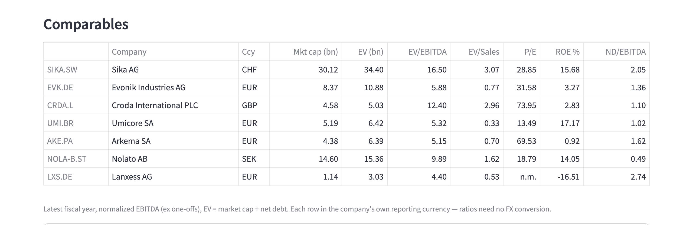
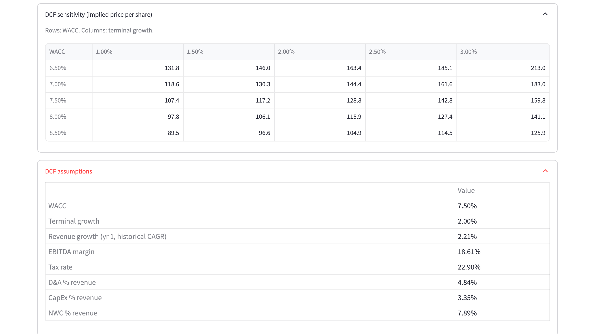
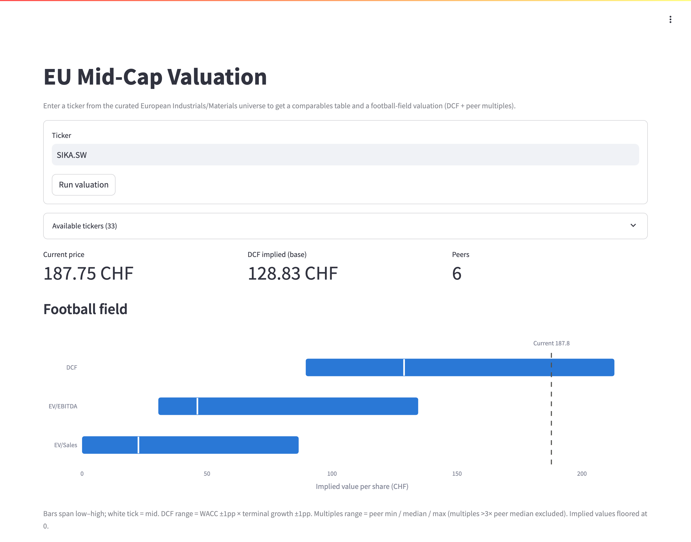

# Case study: Sika AG (SIKA.SW)

An end-to-end run of the tool on one company, from raw statements to a football field. All figures are the tool's own output as of **23 September 2026** (share price CHF 187.45; FX snapshot the same day). Prices move, so a fresh run will differ slightly.

This is a walkthrough of the method, not a recommendation.

## 1. Company snapshot

Sika is a Swiss specialty-chemicals group focused on construction and industrial markets (sealants, adhesives, concrete admixtures, roofing). Market cap is ~CHF 30bn. That is well above the tool's €1–10bn mid-cap band, and it matters for the results (see §6).

## 2. Historical financials

The tool reads four fiscal years from Yahoo Finance; `yfinance` provides no fifth year. Figures are in CHF millions, as reported:

| FY (Dec) | Revenue | EBITDA (normalized) | EBITDA (reported) | Net income | Net debt |
|---|---:|---:|---:|---:|---:|
| 2022 | 10,492 | 1,942 | 1,942 | 1,162 | 1,687 |
| 2023 | 11,239 | 2,008 | 1,998 | 1,062 | 4,795 |
| 2024 | 11,763 | 2,304 | 2,304 | 1,246 | 4,593 |
| 2025 | 11,201 | 2,085 | 2,055 | 1,044 | 4,278 |

The 2023 step-up in net debt reflects the debt-financed acquisition of MBCC Group. Revenue fell 4.8% in CHF in 2025. The revenue CAGR across the available window is 2.2%, and it drives year 1 of the DCF. For Sika, normalized and reported EBITDA are almost identical. That is not true for its peers.

## 3. Building the peer set

The universe CSV tags Sika's peer group as **Chemicals**. The tool keeps candidates from that group whose market cap falls in the €1–10bn band and whose latest-year statements are complete. It then ranks them by market-cap proximity to Sika.

| Candidate | Outcome |
|---|---|
| Evonik, Croda, Umicore, Arkema, Nolato, Lanxess | **Selected** |
| Covestro | Excluded: ~€11.3bn, above the band |
| Victrex | Excluded: ~€1.0bn, just below the band |
| Fuchs | Excluded: no debt data in Yahoo for the latest fiscal year |

Six chemicals peers qualified, so no slots had to be filled from the wider Materials sector. An earlier version matched on sector alone and picked voestalpine (steel), Aurubis (copper) and Buzzi (cement), which are not meaningful comparables for Sika.

## 4. Comparables

Latest fiscal year, normalized EBITDA, EV = market cap + net debt. Each company is shown in its own reporting currency.

| | EV/EBITDA | EV/Sales | P/E | ROE | ND/EBITDA |
|---|---:|---:|---:|---:|---:|
| **Sika** | **16.5×** | **3.07×** | **28.8×** | **15.7%** | **2.05×** |
| Peer median | 5.6× | 0.74× | — | — | — |

Sika trades at about 3× the peer median on EV/EBITDA. Several peers are at cyclical lows: Lanxess has negative earnings (P/E shown as n.m.), and Arkema's P/E of ~70× reflects depressed earnings rather than a high valuation. Croda's reported EBITDA understated normalized EBITDA by 58%. Without normalization, it would have looked like a 19.7× "premium" peer instead of 12.4×.

## 5. DCF

Base case: 7.5% WACC and 2.0% terminal growth, both taken from the hand-set Materials row in `sector_wacc.json`. Other inputs are held flat at FY2025 levels:

| Input | Value |
|---|---:|
| Revenue growth, year 1 → year 5 | 2.2% → 2.0% (linear decay) |
| EBITDA margin (normalized) | 18.6% |
| Tax rate (effective FY2025) | 22.9% |
| D&A / CapEx / NWC, % of revenue | 4.8% / 3.4% / 7.9% |

Unlevered FCF runs from CHF 1.37bn in year 1 to CHF 1.49bn in year 5.

| Bridge | CHF |
|---|---:|
| Enterprise value | 24.95bn |
| – Net debt (FY2025) | 4.28bn |
| = Equity value | 20.67bn |
| ÷ Shares outstanding | 160.4m |
| **= Implied value per share** | **128.8** |

In the sensitivity grid, the current price (CHF 187) is only reached around **6.5% WACC with 2.5% terminal growth** (185.1). Read in reverse, the market is either discounting Sika at a lower cost of capital than a generic Materials name, or expecting growth well above the 2.2% historical CAGR. Both are plausible for a business with Sika's pricing power and track record, and deciding between them is the analyst's call.

## 6. Football field

| Method | Low | Mid | High |
|---|---:|---:|---:|
| DCF (WACC 6.5–8.5% × g 1–3%) | 89.5 | 128.8 | 213.0 |
| EV/EBITDA (peer min / median / max) | 30.5 | 46.3 | 134.3 |
| EV/Sales (peer min / median / max) | 0.0 | 22.6 | 86.6 |
| *Current price* | | *187.45* | |

**How to read it.** The three methods don't converge, and the divergence is the finding:

- **The multiples bars sit far below the price because the peer set is priced differently, not because Sika is necessarily overvalued.** Applying the multiples of European chemical mid-caps at trough earnings to a premium construction-chemicals compounder mostly measures the gap between the two groups. The honest conclusion is that the €1–10bn European universe has no true Sika comparable. A proper peer set would include larger global construction-chemicals and building-products names, which are outside this tool's scope by design.
- **EV/Sales is the least informative bar.** Sika's ~19% EBITDA margin is far above most peers, so a sales multiple systematically undervalues it; the low end is floored at zero. I keep it visible and flag it rather than hide it.
- **The DCF is the only method anchored on Sika's own economics.** Even so, it needs a below-sector WACC or above-history growth to reach today's price.

## 7. What an analyst would do next

These steps are outside the tool's scope and are listed so the gaps are explicit:

- Build a global peer set for construction chemicals, beyond the EU mid-cap universe.
- Replace historical-CAGR growth with consensus or bottom-up segment forecasts.
- Derive a company-specific WACC (beta, credit spread) instead of the sector default.
- Use TTM or forward multiples, and the company's own adjusted EBITDA.
- Form a view on which of the two market-implied stories in §5 is more credible.

---
*Data: Yahoo Finance via yfinance. Not investment advice.*
